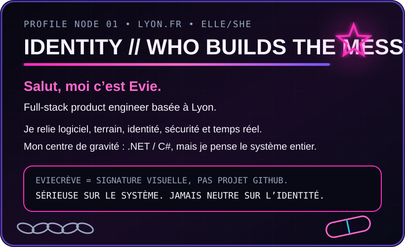
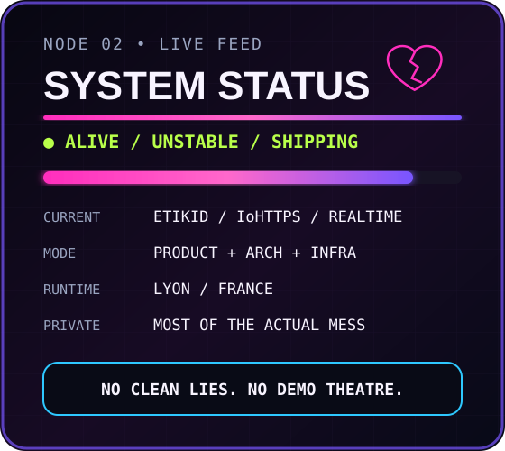
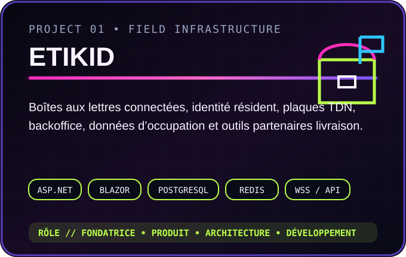
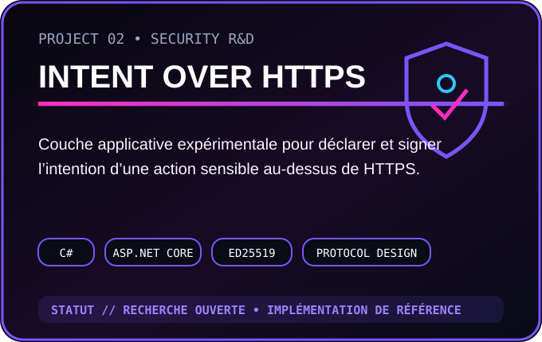

<!-- EVIECRÈVE / art-offline — graphic engineering profile -->

<table width="100%">
<tr>
<td width="60%" valign="top"></td>
<td width="40%" valign="top"></td>
</tr>
</table>

 

<table width="100%">
<tr>
<td width="60%" valign="top"></td>
<td width="40%" valign="top"></td>
</tr>
</table>

 

  
  
  

 

<table width="100%">
<tr>
<td width="50%" valign="top"></td>
<td width="50%" valign="top"></td>
</tr>
</table>

 

 

 

 

