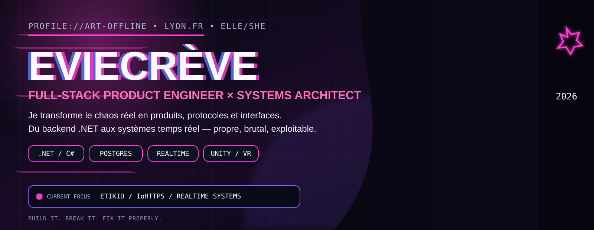
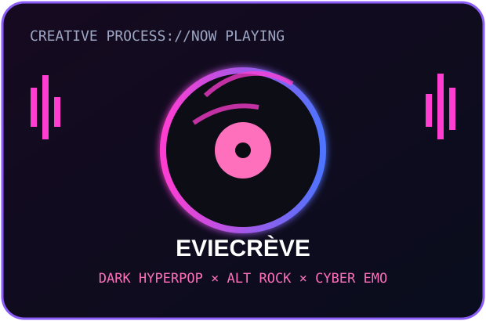
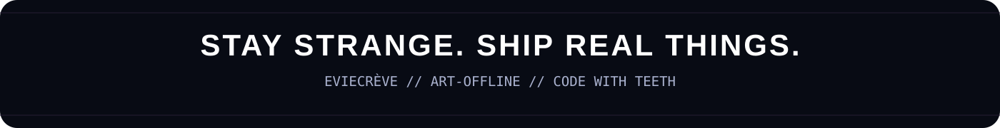

<!--
  EVIECRÈVE / art-offline
  Built like a product page, not a résumé template.
-->

<div align="center">
  
</div>

<br />

<div align="center">
  <a href="https://github.com/art-offline?tab=repositories"></a>
  <a href="https://github.com/art-offline/IoHTTPS"></a>
  
</div>

<div align="center">
  
</div>

<br />

## ✦ IDENTITY // WHO IS EVIE?

<table>
  <tr>
    <td width="57%" valign="top">
      <h3>Salut, moi c’est Evie.</h3>
      <p>
        Développeuse full-stack et product engineer basée à Lyon, je conçois des produits qui relient
        <strong>logiciel, terrain, sécurité, identité et temps réel</strong>. Mon centre de gravité est l’écosystème
        <strong>.NET / C#</strong>, mais je travaille toujours à l’échelle du système entier : architecture,
        expérience, exploitation, déploiement et identité visuelle.
      </p>
      <p>
        <strong>EVIECRÈVE</strong> est aussi mon identité créative : elle influence la façon dont je dessine mes interfaces,
        structure mes produits et refuse les logiciels anonymes. La vibe reste présente, mais ici le sujet central est clair :
        <strong>construire des systèmes sérieux avec une personnalité impossible à diluer.</strong>
      </p>
      <blockquote>
        <strong>Je ne veux pas seulement que ça fonctionne.</strong><br />
        Je veux que ce soit clair, robuste, mémorable — et réparable quand la réalité décide de tout casser.
      </blockquote>
    </td>
    <td width="43%" valign="top">
      
    </td>
  </tr>
</table>

```csharp
var evie = new Person(
    pronouns: "elle / she",
    location: "Lyon, France",
    roles: ["Product Engineer", ".NET Developer", "Founder", "Systems Builder"],
    currentMode: "building things that survive contact with reality"
);
```

<br />

## ✦ BUILDING // CURRENT SYSTEMS

<table>
  <tr>
    <td width="50%" valign="top">
      <h3>📮 ETIKID — infrastructure de boîte aux lettres connectée</h3>
      <p>Produit terrain + plateforme métier : activation résident, identité, plaques connectées, backoffice, données d’occupation et outils partenaires pour les acteurs de la livraison.</p>
      <p><code>ASP.NET</code> <code>Blazor</code> <code>PostgreSQL</code> <code>Redis</code> <code>Docker</code> <code>WSS / API</code></p>
      <sub><strong>Rôle :</strong> fondatrice, produit, architecture et développement.</sub>
    </td>
    <td width="50%" valign="top">
      <h3>🔐 <a href="https://github.com/art-offline/IoHTTPS">Intent over HTTPS</a></h3>
      <p>Une couche applicative expérimentale pour déclarer et signer cryptographiquement l’intention d’une action sensible au-dessus de HTTPS — sans remplacer TLS.</p>
      <p><code>C#</code> <code>ASP.NET Core</code> <code>Ed25519</code> <code>Protocol design</code> <code>Security R&amp;D</code></p>
      <sub><strong>Statut :</strong> recherche ouverte et implémentation de référence.</sub>
    </td>
  </tr>
  <tr>
    <td width="50%" valign="top">
      <h3>🛰️ Agents temps réel &amp; systèmes VRChat</h3>
      <p>Orchestration d’agents Windows, communication WSS, watchdogs, commandes distantes, intégrations OSC et outils Unity destinés aux environnements sociaux en temps réel.</p>
      <p><code>.NET</code> <code>WebSockets</code> <code>OSC</code> <code>Unity 6</code> <code>VRChat SDK</code></p>
      <sub><strong>Obsessions :</strong> résilience, observabilité, récupération automatique.</sub>
    </td>
    <td width="50%" valign="top">
      <h3>⚙️ Infrastructure produit &amp; opérations</h3>
      <p>Déploiements Linux, conteneurs, reverse proxy, bases de données, supervision et chaînes d’exploitation conçues pour rester compréhensibles même lorsqu’un incident arrive à une heure indécente.</p>
      <p><code>Docker</code> <code>Ubuntu Server</code> <code>Caddy</code> <code>PostgreSQL</code> <code>Health checks</code></p>
      <sub><strong>Principe :</strong> aucun composant magique que personne ne sait réparer.</sub>
    </td>
  </tr>
</table>

<br />

## ✦ STACK // WORKING MATERIAL

<div align="center">
  
</div>

<br />

<div align="center">
  
  
  
  
  
  
  
  
</div>

<table>
  <tr>
    <td width="33%" valign="top"><h4>ARCHITECTURE</h4><p>Monolithes modulaires, APIs métier, WSS, protocoles, workers, intégrations partenaires et sécurité pragmatique.</p></td>
    <td width="33%" valign="top"><h4>PRODUCT</h4><p>Flux réels, backoffices, onboarding, interfaces responsive, automatisation et décisions guidées par le terrain.</p></td>
    <td width="33%" valign="top"><h4>OPERATIONS</h4><p>Docker, Linux, reverse proxy, health checks, logs, reprise sur erreur et déploiements que je peux comprendre à 3 h du matin.</p></td>
  </tr>
</table>

<br />

## ✦ SIGNAL // PUBLIC ACTIVITY

<div align="center">
  
  
</div>

<div align="center">
  
</div>

> Une partie importante de mon travail vit dans des dépôts privés : produit, infrastructure, systèmes partenaires et R&amp;D en cours. Les carrés publics ne racontent donc qu’une partie de l’histoire.

<br />

## ✦ MANIFESTO // HOW I BUILD

<table>
  <tr>
    <td width="25%" align="center"><strong>01 — REAL</strong><br /><sub>Construire pour des personnes, des contraintes et des incidents réels.</sub></td>
    <td width="25%" align="center"><strong>02 — LEGIBLE</strong><br /><sub>Une architecture doit pouvoir être expliquée, exploitée et réparée.</sub></td>
    <td width="25%" align="center"><strong>03 — DISTINCT</strong><br /><sub>Une identité forte fait partie du produit, pas du vernis marketing.</sub></td>
    <td width="25%" align="center"><strong>04 — SHIPPED</strong><br /><sub>La perfection qui ne sort jamais ne protège personne et n’aide personne.</sub></td>
  </tr>
</table>

```text
EVIE.OS // CURRENT FOCUS
├── ETIKID ............... partner-ready delivery infrastructure
├── IoHTTPS .............. verifiable intent over existing web standards
├── realtime agents ...... resilient orchestration for VR / Windows
└── operations ........... infrastructure that stays understandable
```

<div align="center">
  <h3>Je suis ouverte aux collaborations sérieuses autour de produits .NET, d’architecture applicative, de protocoles et d’expériences interactives.</h3>
  <a href="https://github.com/art-offline"></a>
</div>

<br />

<div align="center">
  
</div>